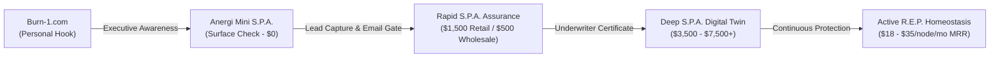
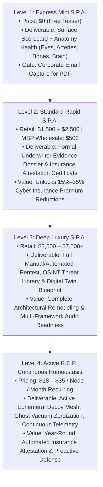
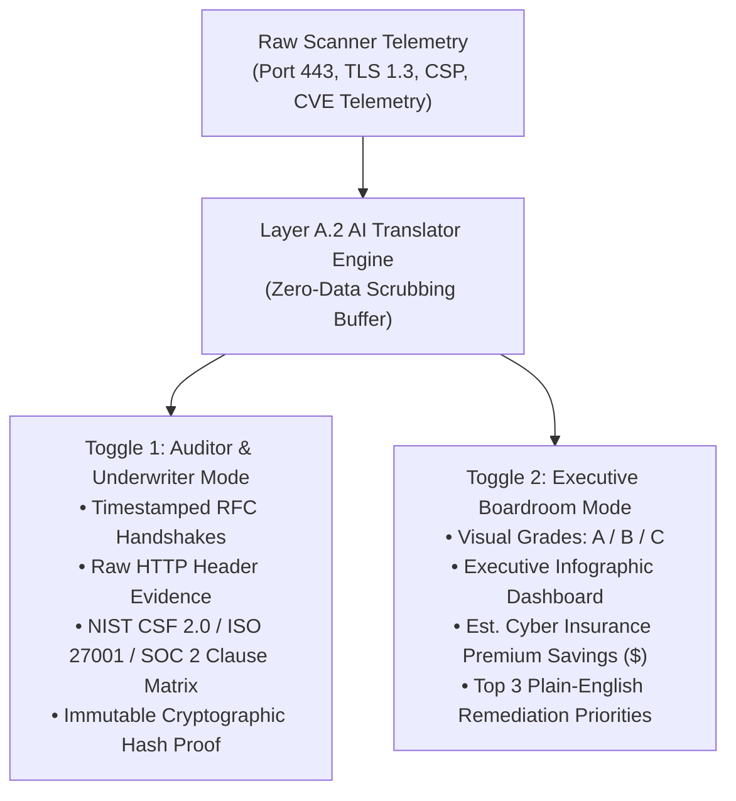
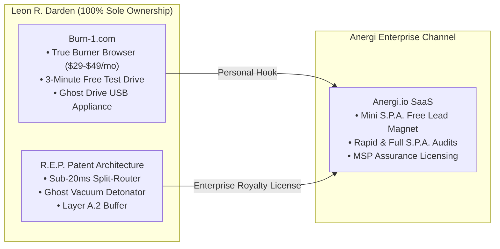

# Anergi S.P.A. & R.E.P. Market Capture Strategy
## Distilled Case Study: The Cobalt Benchmark, MSP Arbitrage & Continuous Ephemeral Homeostasis

---

### Executive Overview & Strategic Thesis
Traditional penetration testing platforms (such as Cobalt.io, Synack, and legacy MSSPs) suffer from an inherent commercial flaw: they deliver dry, text-dense vulnerability dumps that overwhelm executive decision-makers while demanding exorbitant retainers ($15,000–$40,000+) and weeks of lead time. 

By contrast, **Anergi.io** leverages an undeniable unfair advantage: **intuitive physiological visual design** combined with an **automated underwriter-grade attestation engine**. 



---

## 1. Visual Superiority: Anatomy Metaphors vs. Competitor Monotony

Competitor websites and client dashboards (Qualys, CrowdStrike, Cobalt, Mandiant) look virtually indistinguishable: sterile blue-and-white SaaS templates filled with dense spreadsheets. They communicate with junior sysadmins, not boardrooms or business owners.

Anergi eliminates this friction by translating abstract cybersecurity vectors into visceral human anatomy:

| Sector | Cyber Engineering Focus | Physiological Metaphor | Intuitive Non-Technical Meaning |
| :--- | :--- | :--- | :--- |
| **The Eyes** | DNSSEC, Dangling CNAMEs, SPF/DKIM/DMARC | Visual Perception & Perimeter Vision | *"Are your external windows watched or blind?"* |
| **The Arteries** | TLS 1.3, Cipher Suites, Perfect Forward Secrecy | Cardiovascular Transit & Blood Flow | *"Is data in transit protected against interception?"* |
| **The Bones** | HTTP Framing, CSP `frame-ancestors`, Clickjacking | Skeletal Structural Integrity | *"Is your digital foundation resistant to structural collapse?"* |
| **The Brain** | AI Model Endpoints, Prompt Injection, ISO 42001 | Cognitive Architecture & Executive Control | *"Are automated decision engines quarantined from poisoning?"* |

> [!NOTE]
> This biological translation allows non-technical CEOs, CFOs, and MSP account executives to immediately understand severity without needing a CISSP certification, while the underlying technical view provides cryptographic proof for auditors.

---

## 2. Pricing Recalibration & The 4-Tier S.P.A. Pipeline

The original **$500 price point** was an early placeholder. Placing a $500 public retail price on an enterprise cyber assessment creates a negative credibility bias among corporate buyers spending $50,000+ on cyber insurance. 

Instead, $500 represents the **wholesale engine price** for channel partners.



---

## 3. The MSP Channel Arbitrage Engine (The High-Velocity B2B Multiplier)

Managed Service Providers (MSPs) manage IT infrastructure for dozens of small-to-medium businesses (law practices, medical networks, financial planners). 

### The MSP Pain Point
- **Liability Terror:** MSPs fear client breaches and resultant negligence lawsuits.
- **Talent Scarcity:** MSPs lack internal red-team engineers capable of writing 60-page compliance dossiers.
- **Time Bottleneck:** Manual security audits stall client onboarding.

### The Anergi Solution & Profit Equation
Anergi sells MSPs an automated **Assurance & Attestation Engine** on a wholesale basis:

$$\begin{aligned}
\text{Upfront Audit Profit (25 Clients)} &= 25 \times (\$1,500 \text{ retail} - \$500 \text{ wholesale}) = \mathbf{\$25,000 \text{ Net}} \\
\text{Active Node MRR (250 Nodes)} &= 250 \times (\$25 \text{ retail} - \$10 \text{ wholesale}) = \mathbf{\$3,750/\text{month} \ (\text{\$45,000/year})}
\end{aligned}$$

| Channel Model | Unit Volume | Wholesale (Anergi Receives) | Retail (MSP Billed to Client) | MSP Net Margin |
| :--- | :--- | :--- | :--- | :--- |
| **S.P.A. Assurance Audits** | 25 corporate accounts | $12,500 (one-time) | $37,500 (one-time) | **+$25,000 pure margin** |
| **R.E.P. Decoy Nodes** | 250 active nodes (10/client) | $2,500 / month | $6,250 / month | **+$3,750 / mo MRR ($45k/yr)** |

The end client happily pays $1,500 because the resulting **Underwriter Attestation Certificate** can shave $10,000–$25,000 off their annual cyber insurance premiums.

---

## 4. Layer A.2 AI Translator: Resolving the Technical/Executive Divide

Layer A.2 of the R.E.P. architecture functions as an isolated scrubbing diode and cognitive translator. It ingests raw scanner telemetry and automatically produces two synchronized views:



---

## 5. Official Attestation Certificate Blueprint

Below is the certified layout delivered to underwriters, board members, and MSP clients upon completion of Level 2 / Level 3 S.P.A. audits:

```text
====================================================================================================
 🛡️   A N E R G I   A L L I A N C E   |   S . P . A .   A T T E S T A T I O N   S E A L
====================================================================================================

                       CERTIFICATE OF DIGITAL RESILIENCE & POSTURE
                                 UNDERWRITER EVIDENCE DOSSIER

   This certifies that the public digital perimeter and transport infrastructure for:

                             [ TARGET CLIENT DOMAIN / ENTITY ]

   has been evaluated via the Anergi Security Posture Assessment (S.P.A.) engine and satisfies
   baseline criteria for multi-framework compliance, data isolation, and perimeter transport hygiene.

----------------------------------------------------------------------------------------------------
  VERIFIED COMPLIANCE MAPPINGS & REGULATORY STANDARDS:
----------------------------------------------------------------------------------------------------
  [✔] NIST CSF 2.0          : Controls PR.DS-01, PR.DS-02, DE.CM-01 (Verified Transport Hygiene)
  [✔] ISO/IEC 27001:2022    : Annex A.8.20 & A.8.24 Network & Data Security (Active Enforcement)
  [✔] SOC 2 Type II         : Trust Services Criteria - Security & Confidentiality (Boundary Aligned)
  [✔] HIPAA / HITECH        : Layer A.2 Zero-Data Ingress Isolation (Non-Exfiltration Confirmed)
  [✔] SEC Incident Protocol : CISO Risk Governance & Rapid Containment Readiness (SLA Certified)

----------------------------------------------------------------------------------------------------
  CRYPTOGRAPHIC PROOF & UNDERWRITER AUDIT TRAIL:
----------------------------------------------------------------------------------------------------
  Digital Twin System ID   : DT-8849-REP-ACTIVE
  Audit Timestamp          : 2026-10-09 T16:20:00 UTC
  Cryptographic Hash Proof : 0x7F9B2C4E88A1902BDC43110E98AA12F4 (SHA-256 Verified)
  Insurance Discount Code  : ANERGI-UNDERWRITER-CREDIT-2026
----------------------------------------------------------------------------------------------------
  ISSUED BY: Anergi Alliance SecOps Engine  |  TECHNOLOGY: Ricochet Ephemeral Protocol (R.E.P.)
====================================================================================================
```

---

## 6. Three-Entity Sovereign Ecosystem & Intellectual Property Boundary

To protect Leon's sovereignty and ensure long-term defensibility, the ecosystem maintains strict contractual and technical boundaries:



1. **Burn-1 (`burn-1.com`):** 
   - 100% sovereign asset owned exclusively by Leon R. Darden.
   - Consumer/executive privacy flagship offering the True Burner Browser (in-memory pixel streaming, hard 29-minute countdown timer, sub-millisecond Ghost Vacuum zeroization).
   - Functions as the top-of-funnel consumer hook. After completing a 3-minute free test drive, the executive sees: *"Your personal browser is sterile. Is your company's front door exposed? Scan your domain at Anergi.io."*
2. **Anergi (`anergi.io`):** 
   - The commercial B2B sales portal and compliance translation platform.
   - Runs the Mini S.P.A., Rapid S.P.A., Full S.P.A., and manages MSP wholesale distribution.
   - Sells the Underwriter Attestation Certificate and boardroom scorecards.
3. **R.E.P. (Ricochet Ephemeral Protocol):** 
   - Patented core invention and source code owned 100% by Leon.
   - Licensed into Anergi for enterprise node deployments (generating per-node recurring monthly royalties to Leon).

---

## 7. Immediate Execution Checklist & Live Platform Status

- [x] **`mini_spa.html` Lead Gate Implemented:**
  - Removed all public $500 placeholders.
  - Retained all physiological meters (Eyes, Arteries, Bones, Brain).
  - Added corporate work email modal gate on PDF export.
  - Gated granular server hardening directives behind authorized corporate contact submission.
- [x] **Competitor Advantage Secured:**
  - Anergi CISO Command Deck (`news.html`), Treatment schematic (`treatment.html`), and Mini S.P.A. deliver visual engagement that competitors cannot replicate.
- [ ] **Anergi Partnership Alignment:**
  - Present the **Mutual Non-Disclosure & Intellectual Property Non-Assertion Agreement (MNDA)** to the Anergi owner ensuring sovereign ownership of R.E.P. and Burn-1 assets.
  - Pitch the MSP Assurance Wholesale Model ($500 wholesale / $1,500 retail) as the primary enterprise sales engine.
