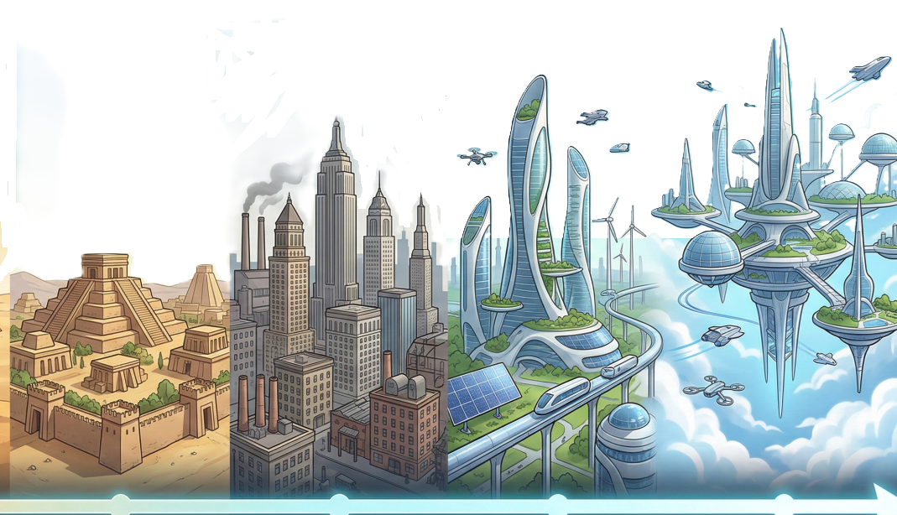

# LEON R. DARDEN // NEURAL COMMAND CENTER
### AI Solutions Architect & Enterprise Automation Specialist

## 🛡️ Strategic Capabilities Matrix
This portfolio is an immersive **Human-in-the-Loop (HITL)** environment showcasing eight core strategic nodes designed for enterprise-grade AI deployment.

### 🧩 Core Synthesis Nodes
1. **Deep Thinking Node**: Advanced long-form reasoning utilizing Chain-of-Thought (CoT) logic.
2. **Eval Sentinel**: Autonomous evaluation layer for bias detection and safety hardening.
3. **Vector Vault**: Enterprise RAG indexing system for sub-millisecond retrieval of unstructured data.
4. **Brand Builder 007**: Multi-modal branding engine governed by a rigorous Eval Pipeline.
5. **Hydro-Scan (Vox)**: Full-stack RAG assistant transforming telemetry into structured hydration metrics.
6. **SnapBack AI Agent**: Sentiment-aware reputation agent utilizing advanced prompt-chaining.
7. **Employee Scheduler**: Agentic workflow automating personnel logistics through recursive reasoning.
8. **Patching Protocol**: Interactive logic diagnostic and realignment protocol (Sector 08).

---

## 🛠️ Technical Infrastructure
*   **Logic Core**: Google Gemini 1.5 Flash / Pro (Multimodal)
*   **Front-End**: React (Vite) + Tailwind CSS + Lucide Icons
*   **Data Backbone**: Firebase Firestore (Real-time Neural Sync)
*   **Aesthetics**: Glass-morphism, "Neural Flux" Transitions, Atmospheric Soundscapes

## 🎓 Verified Architecture
*   **Google AI Specialization**: 7-Course Professional Credential
*   **Google Prompting Essentials**: Advanced Prompt Engineering & HITL Frameworks

---

## 🔗 Connect with the Architect
*   **Portfolio**: [Live Site](https://leonrdardenaitech.github.com/arch-tool/)
*   **LinkedIn**: [Network](https://www.linkedin.com/in/leon-darden-686899a5)
*   **Email**: Leonrdarden@gmail.com

*"Efficiency is the only constant. Synthesis is the only objective."*
