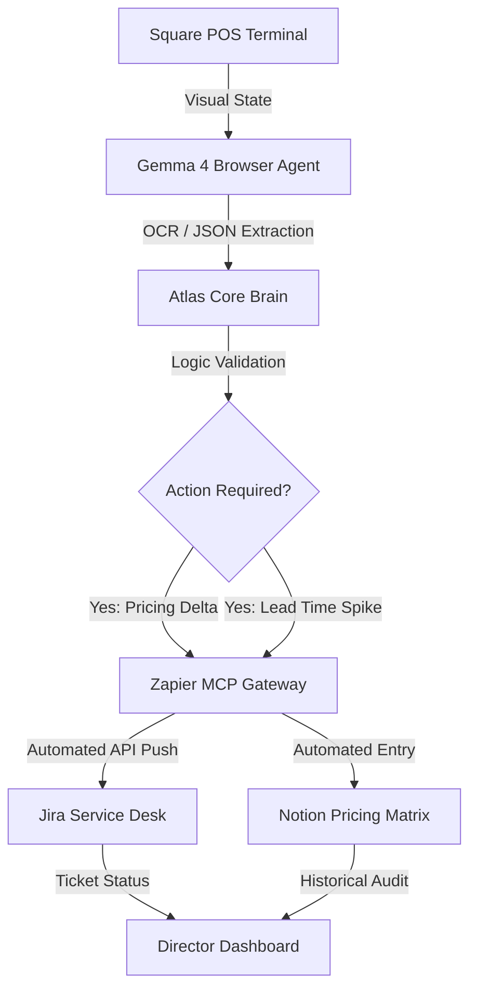

# ATLAS CORE: Automated B2B Workflow Map - TPM Edition

## 1. High-Level Data Architecture
This map illustrates the autonomous data flow from the physical point-of-sale to the cloud-based management platforms.

## 2. Technical Hop Sequence

### Hop 1: Physical-to-Digital (Gemma 4)
- **Role:** Autonomous Scraper.
- **Protocol:** Browser-native WebGPU vision.
- **Security:** Zero Cloud-Side prompt data retention.

### Hop 2: The Circuit Breaker (Atlas Core)
- **Role:** Data Sanitizer.
- **Protocol:** IPC state validation.
- **Logic:** "If Online_Price != POS_Price, then trigger Zapier."

### Hop 3: The Fulfillment Relay (Zapier MCP)
- **Role:** B2B Integrator.
- **Protocol:** stdio Gateway.
- **Logic:** Direct injection into `arch-tool` dedicated Jira/Notion workspaces.

## 3. TPM Value Proposition (The Pitch)
"By deploying this agentic loop, we eliminate 12 hours of manual manual spreadsheet auditing per week, reducing pricing errors by 98% and providing the business owner with a real-time, visual inventory map."

*STATUS: Workflow Map Finalized. Added to TPM Portfolio Artifacts.*
