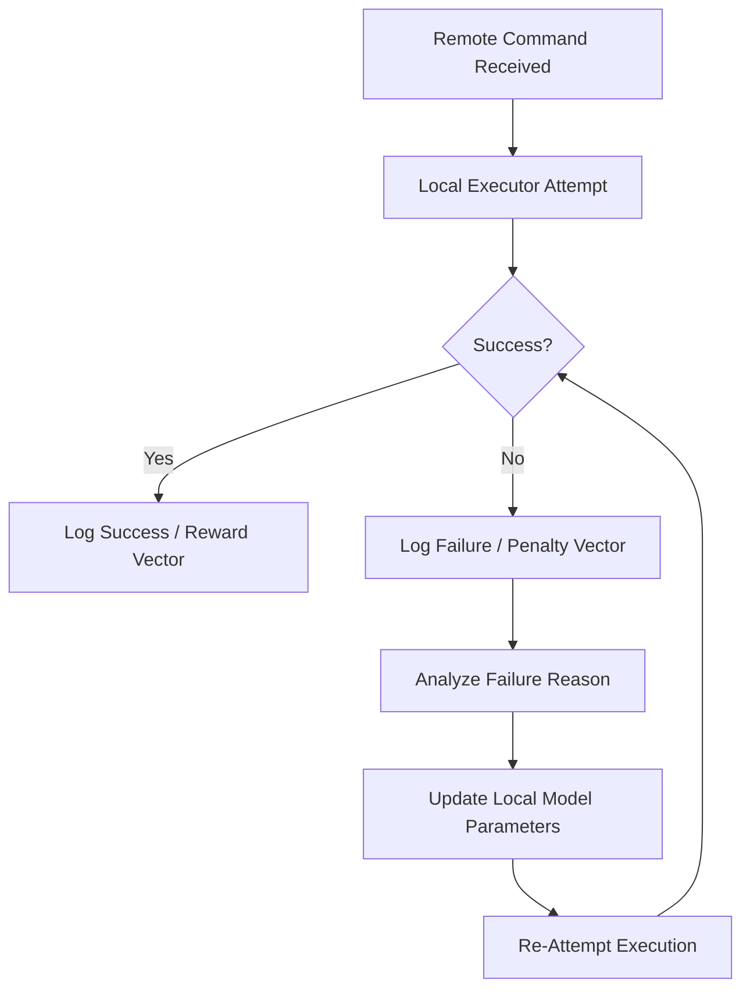

# ATLAS CORE: Swarm Learning Simulator v1.0

## 1. Objective
To demonstrate the "Hierarchical Adaptable Agent Swarm" logic where failed executions are logged and utilized to refine future model parameters.

## 2. The Feedback Loop (Logical Flow)

## 3. Mock Data Log: Learning Event #001
- **Task:** "Click 'Deploy' button on legacy Square POS dashboard."
- **Attempt 1:** FAILED. 
  - **Reason:** Visual anchor shifted by 15 pixels due to ad-banner insertion.
- **Agent Reasoning:** "Vision-Anchoring failed. UI mismatch detected."
- **Swarm Optimization:**
  - Increased visual scan radius by 20%.
  - Added 'Dynamic Element Search' layer before click execution.
- **Attempt 2:** SUCCESS.
  - **Result:** Deploy button correctly identified and triggered.

## 4. Swarm Registry
- **Node_Web:** Gemma 4 (Browser Agent)
- **Node_OS:** PyAutoGUI (Local Macro)
- **Node_Logic:** Atlas (High-Level Strategy)

*STATUS: Swarm Intelligence active. Continuous optimization protocol running.*
